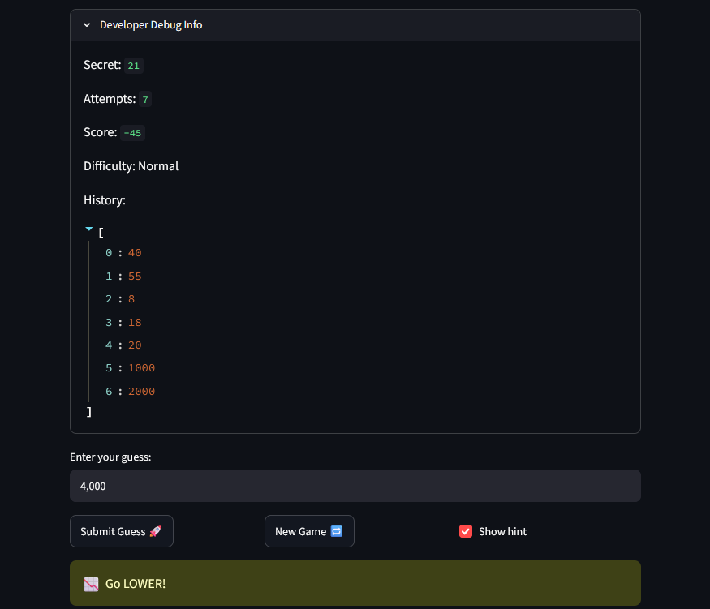

# 🎮 Game Glitch Investigator: The Impossible Guesser

## 🚨 The Situation

You asked an AI to build a simple "Number Guessing Game" using Streamlit.
It wrote the code, ran away, and now the game is unplayable. 

- You can't win.
- The hints lie to you.
- The secret number seems to have commitment issues.

## 🛠️ Setup

1. Install dependencies: `pip install -r requirements.txt`
2. Run the broken app: `python -m streamlit run app.py`

## 🕵️‍♂️ Your Mission

1. **Play the game.** Open the "Developer Debug Info" tab in the app to see the secret number. Try to win.
2. **Find the State Bug.** Why does the secret number change every time you click "Submit"? Ask ChatGPT: *"How do I keep a variable from resetting in Streamlit when I click a button?"*
3. **Fix the Logic.** The hints ("Higher/Lower") are wrong. Fix them.
4. **Refactor & Test.** - Move the logic into `logic_utils.py`.
   - Run `pytest` in your terminal.
   - Keep fixing until all tests pass!

## 📝 Document Your Experience

- [ x] Describe the game's purpose.
# the purpose of the game is to try to get you to guest the secret number with a hot cold aspect
- [ x] Detail which bugs you found.
- [ x] Explain what fixes you applied.

## 📸 Demo Walkthrough

Describe your fixed game in numbered steps so a reader can follow along without watching a video:

1. # for the 1st thing i fixed that it did accept numbers with commas and ckaude help by using .replace() but missed casting the value to int so i did that part.
2. # for the negative numers i had switch the grater than and less than symbols that seem to work manual testing also fixed the backwards function and got it to work properly. but it kept failing the pytest and i used chatGBT to simplify the code .
3.  # for the new game button i had copyed and paised the history list and the status but i was missing the randint(low,high) and cluade help me see that.
4.
5. 

**Screenshot** *(optional)*: <!-- Insert a screenshot of your fixed, winning game here -->


## 🧪 Test Results

```
#======================================================================================================================== test session starts ========================================================================================================================
platform win32 -- Python 3.13.15, pytest-9.1.1, pluggy-1.6.0
rootdir: E:\Codepath 110\ai110-module1show-gameglitchinvestigator-starter
plugins: anyio-4.15.1
collected 3 items                                                                                                                                                                                                                                                    

tests\test_game_logic.py ...                                                                                                                                                                                                                                   [100%]

========================================================================================================================= 3 passed in 0.02s =========================================================================================================================
(.venv) PS E:\Codepath 110\ai110-module1show-gameglitchinvestigator-starter> 

## 🚀 Stretch Features

- [ ] [If you choose to complete Challenge 4, describe the Enhanced UI changes here — a screenshot is optional]
